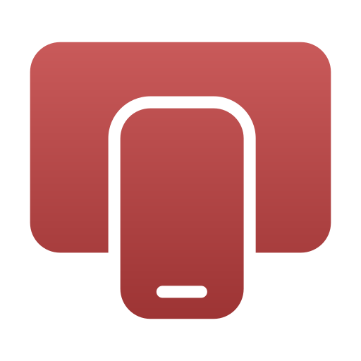

<p align="center">
  
</p>
<h1 align="center">ScrcpyUI Pro (Desktop)</h1>
<p align="center">
  A polished Electron + React desktop UI for <a href="https://github.com/Genymobile/scrcpy">scrcpy</a>, with a smooth Windows installer and a clean, fast UX.
</p>

<p align="center">
  <a href="https://nodejs.org/"></a>
  <a href="https://www.electronjs.org/"></a>
  <a href="https://react.dev/"></a>
  <a href="https://vitejs.dev/"></a>
  
  
</p>

---

## Table of Contents
- Overview
- Features
- Screenshots
- Requirements
- Quick Start (Development)
- Build & Installer
- Configuration
- Project Structure
- Ports & Networking
- Troubleshooting
- Roadmap
- Contributing
- Security & Privacy
- License
- Credits

---

## Overview
ScrcpyUI Pro is a desktop application that wraps scrcpy with a modern, user‑friendly interface. It includes a Windows installer, consistent branding, and a small Express backend to orchestrate commands.

- Tech Stack: Electron (Forge + NSIS), React, Vite, Express
- OS: Windows 10/11
- Executable Name: `ScrcpyUIPro.exe`
- App ID (Windows taskbar): `com.tusharkumarroy.scrcpyuipro`

---

## Features
- Fast, clean UI for scrcpy
- Windows NSIS installer with Start Menu/Desktop shortcuts
- Taskbar icon + custom branding
- “Made with ❤️ by Oparthib” credit section
- Express backend for command orchestration
- Vite optimizations with vendor chunk splitting
- TypeScript-friendly setup

---

## Screenshots
Place screenshots in `docs/` and update links:
- UI: `docs/screenshot-ui.png`
- Installer: `docs/screenshot-installer.png`

---

## Requirements
- Windows 10/11
- Node.js 18+
- scrcpy & adb  
  - If bundled in `resources/bin`, no extra setup is needed  
  - Otherwise ensure `scrcpy` and `adb` are on `PATH`

---

## Quick Start (Development)

1) Install dependencies
```powershell
npm install
```

2) Start backend (Express on port 3001)
```powershell
npm run backend
```

3) Start web (Vite dev server on port 3000)
```powershell
npm run dev
```

4) Launch Electron (loads http://localhost:3000 in dev)
```powershell
npm start
```

Connect your device with USB debugging and go.

---

## Build & Installer

- Production web build
```powershell
npm run build
```

- Create Windows installer (NSIS)
```powershell
npm run make
```

- Output (example)
```
out\make\nsis\make\ScrcpyUIPro Setup 1.0.0.exe
```

Install and run from Start Menu or Desktop shortcut.

---

## Configuration

### App Metadata
- `package.json`
  - `productName: "ScrcpyUIPro"`
  - `build.productName: "ScrcpyUIPro"`
  - `build.appId: "com.tusharkumarroy.scrcpyuipro"`
- `forge.config.cjs`
  - `packagerConfig.name = "ScrcpyUIPro"`
  - `packagerConfig.executableName = "ScrcpyUIPro"`

### Icons
- Put `icon.ico` in `build/`
- Ensure it’s bundled as a resource (in `forge.config.cjs` via `extraResource`)

In `main.js`, use the correct icon path for dev vs. packaged app:
```js
icon: isDev
  ? path.join(__dirname, 'build/icon.ico')
  : path.join(process.resourcesPath, 'icon.ico')
```

Set Windows AppUserModelID on ready:
```js
if (process.platform === 'win32') {
  app.setAppUserModelId('com.tusharkumarroy.scrcpyuipro');
}
```

### Environment Variables
Create `.env.local` (optional):
```
# Example (if using AI or external APIs)
GOOGLE_API_KEY=your_key_here

# If needed for dev overrides
VITE_API_BASE=http://localhost:3001
```

---

## Project Structure
```
scrcpyui-pro-desktop/
├─ build/                # icon.ico and app icons
├─ dist/                 # Vite production output (auto-generated)
├─ out/                  # Installer & packaged app (auto-generated)
├─ resources/
│  ├─ bin/               # Optional bundled scrcpy/adb and assets
│  ├─ author.png
│  └─ logo.png
├─ main.js               # Electron main
├─ preload.cjs           # Electron preload
├─ server.js             # Express backend
├─ App.tsx               # React UI
├─ vite.config.ts        # Vite config
├─ forge.config.cjs      # Electron Forge + NSIS
├─ package.json
└─ vite-env.d.ts
```

---

## Ports & Networking
- Dev Web: `3000` (Vite)
- Backend: `3001` (Express)
- ADB (wireless): typically `5555`

Current behavior uses fixed ports; a dynamic port finder can be added later.

---

## Troubleshooting

### “Missing Shortcut” after install
Windows may look for `ScrcpyUI Pro.exe` if any config still uses a spaced name.

Fix:
1. Uninstall all “ScrcpyUI Pro/ScrcpyUIPro” in Windows Settings → Apps
2. Delete app data folder (if exists):  
   `C:\Users\<you>\AppData\Local\scrcpyui_pro_desktop` (or similarly named)
3. Ensure configuration consistency:
   - `productName`, `packagerConfig.name`, and `executableName` are **all** `ScrcpyUIPro`
   - NSIS maker sets `shortcutName: "ScrcpyUIPro"`
4. Clean build artifacts and rebuild:
```powershell
Remove-Item -Recurse -Force out, dist
npm run build
npm run make
```

### Installer says “App cannot be closed”
Processes may still be running.
```powershell
taskkill /F /IM "ScrcpyUIPro.exe" /IM "scrcpyui-pro-desktop.exe" /IM "ScrcpyUI Pro.exe" /IM "electron.exe" /IM "node.exe" /T
```
Click Retry in the installer.

### Taskbar icon missing in packaged app
- Ensure `build/icon.ico` exists
- Ensure it’s added to `extraResource`
- Use `process.resourcesPath` in production for the icon path
- Set `app.setAppUserModelId('com.tusharkumarroy.scrcpyuipro')`

### Vite large chunk warnings
Vendor chunking is configured in `vite.config.ts` and `chunkSizeWarningLimit` increased.

### TypeScript image imports
`vite-env.d.ts` declares `*.png`, `*.jpg`, `*.svg` modules.

### scrcpy/adb not found
Add to PATH or bundle in `resources/bin`.

### SmartScreen
Windows may flag unsigned installers. Consider code signing for public releases.

---

## Roadmap
- Dynamic port detection for dev/prod
- Auto-detect scrcpy/adb with guided setup
- Multi-device sessions & profiles
- Settings persistence
- Auto-update support
- Theming & layout presets

---

## Contributing
- Fork and create feature branches
- Keep UI consistent with current styles
- Don’t commit secrets; use `.env.local`
- Run build/test before PRs

---

## Security & Privacy
- No data collection by default
- External services (e.g., AI APIs) require your own keys
- Keep keys out of version control

---

## License
MIT — see `LICENSE` for details.

---

## Credits
- UI & branding by Oparthib (Tushar Kumar Roy)
- scrcpy by Genymobile
- Icons by lucide-react
- Built with Electron, React & Vite
*** End Patch```} /> ***!
